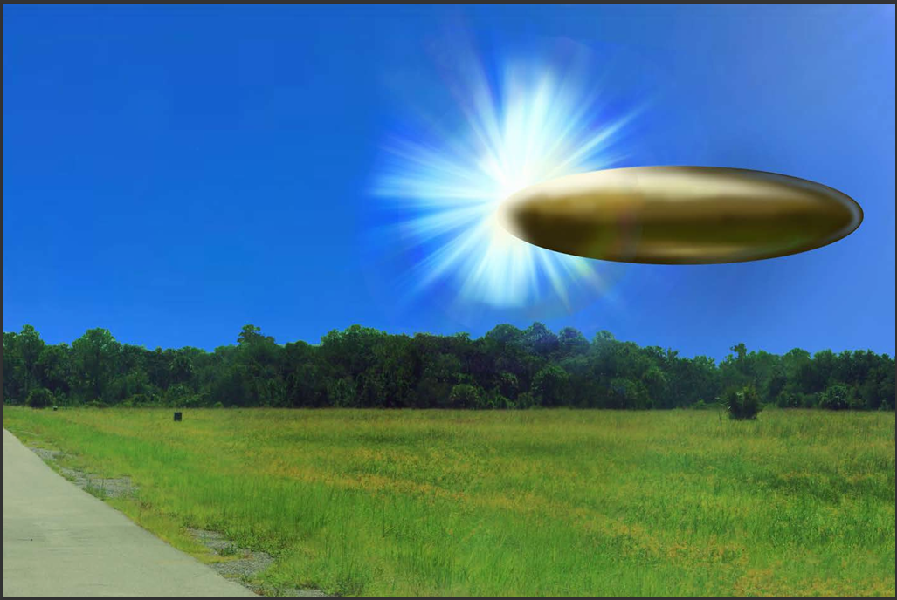
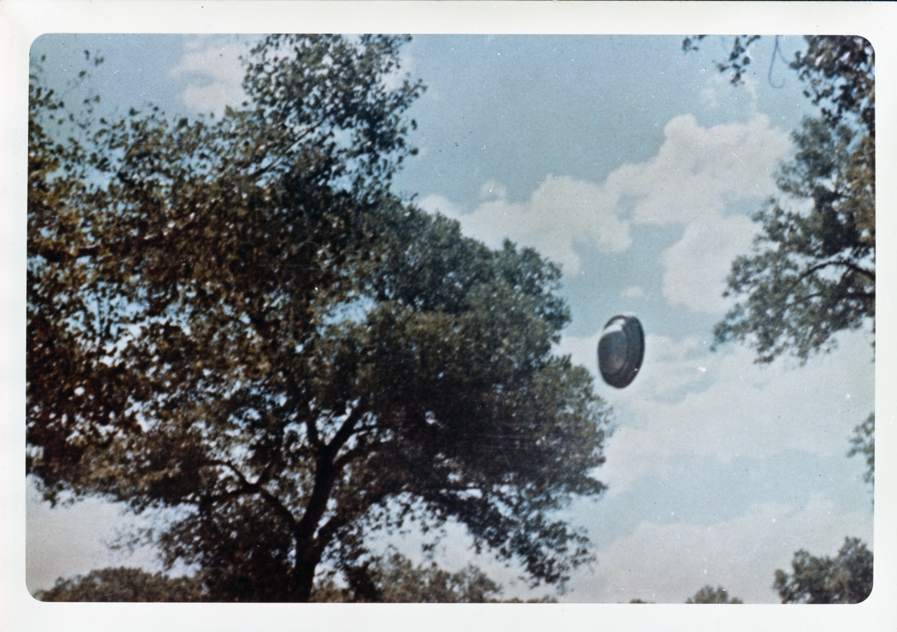
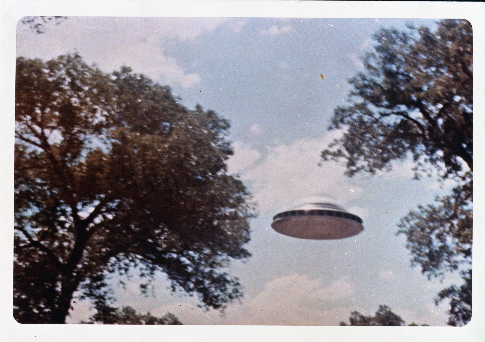

<div align="center">
  

  # 🛸 UFO PHENOMENA ARCHIVE
  
  *A comprehensive collection of documented unidentified aerial phenomena (UAP) and extraterrestrial research.*

  []()
  []()
  []()
  []()
</div>

---

## 📝 Overview
This repository serves as a centralized hub for UFO enthusiasts, researchers, and investigators. It contains a curated selection of visual evidence, high-resolution documentation, and structured research data regarding anomalous aerial phenomena. Our mission is to preserve and organize documented sightings for open-source analysis.

## 📂 Project Structure
```text
├── images/           # High-resolution sightings and documentation
├── videos/           # Documented video footage (DOD-source)
├── UFO.xlsx          # Structured sighting data & analysis
└── README.md         # Documentation & Media Gallery
```

## 🎥 Video Evidence
Below is a featured piece of documented footage from official archives.

<div align="center">
  <video src="videos/DOD_111689232.mp4" width="85%" controls>
    Your browser does not support the video tag.
  </video>
  <p><i>Official Footage: DOD_111689232.mp4</i></p>
</div>

## 🖼️ Visual Gallery
A collection of visual evidence captured during various sightings.

<div align="center">
  <br/>
</div>

<div align="center">
  <br/>
</div>

## 📊 Research & Data
Detailed sightings and metadata are organized in our primary data file:
*   [📊 UFO.xlsx](UFO.xlsx) - Includes timestamps, geographic coordinates, and observer notes.

---
<div align="center">
  <p><i>"The truth is out there."</i></p>
  <strong>UFO Research Archive © 2026</strong>
</div>

